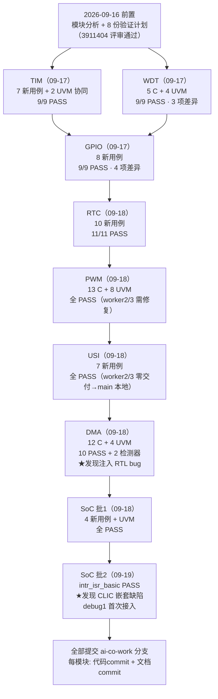
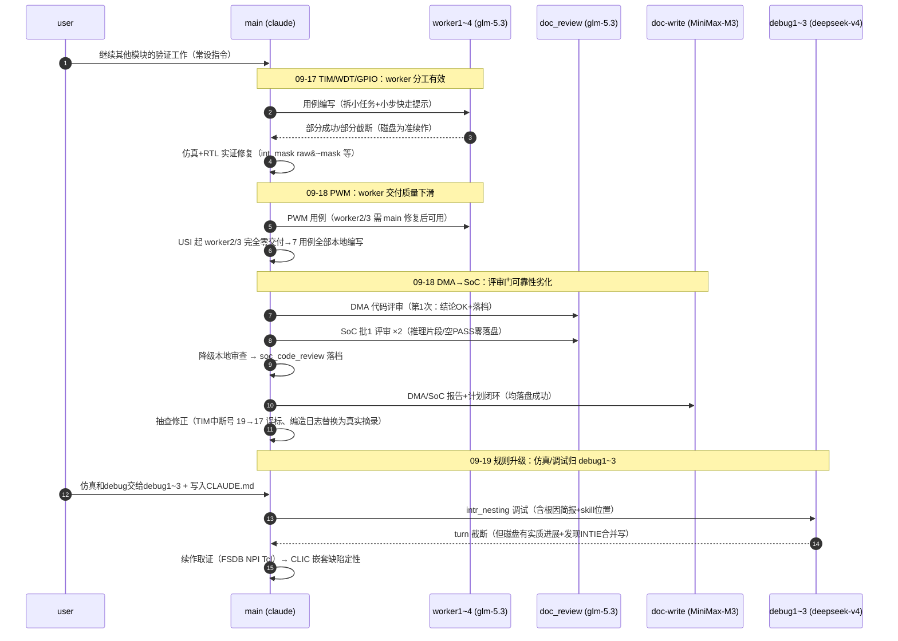
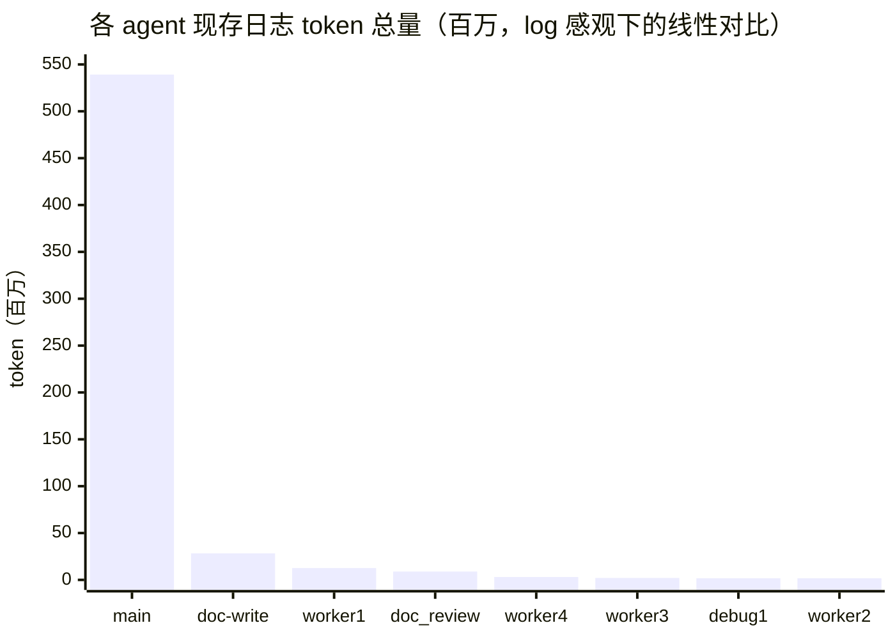
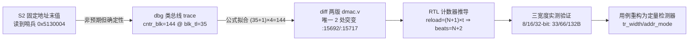
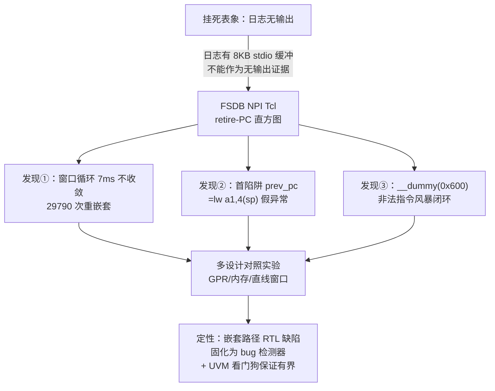
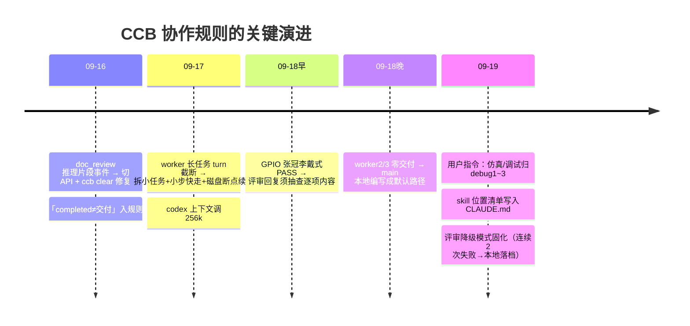

# 工作流总结：CCB 多 Agent 协作完成 wujian100 全模块验证（2026-09-16 ~ 09-19）

> 范围：TIM / WDT / GPIO / RTC / PWM / USI / DMA 七个外设模块 + SoC 级（两批）验证的完整多 agent 协作过程。本文聚焦**协作方法论与经验**，技术结论详见 `doc_summary/verification_report/*_verification_report.md` 与对应验证计划。格式参考 `workflow_retrospective_tim_20260917.md`。
> 角色分工（.claude/CLAUDE.md）：`coding`→worker1~4、`debug`→debug1~3（09-19 新增）、`审查`→doc_review、`文档`→doc-write、主控=main（claude）。

---

## 1. 任务背景与目标

- **输入**：8 份模块分析文档 + 8 份已评审验证计划（7 模块 F1~F17 + SoC 级 F1~F14）；既有 legacy 用例（timer/gpio/dma/pwm/usi_*/wdt/rtc/map_test）；wujian100_open_for_debug RTL（含注入 bug）。
- **目标**：各模块按计划执行——新用例编写、串行仿真、评审门、代码提交、验证报告 + 计划闭环（TBD 清零）。
- **约束**：绝不修改 RTL；Spec 为金标准，真实 RTL 行为异常记为 bug/发现而非对齐用例；共享仿真目录禁止并发仿真；长任务拆分防 turn 截断。

## 2. 整体工作流（跨 7 模块 + SoC 两批）

每模块内部的标准节拍（以最复杂的 DMA 为例）：

## 3. 多 Agent 协作时序（全景精选）

## 4. Agent 实际表现与可靠性记录（按模块）

| 模块 | coding 委派 | 实际交付 | 评审门 | 文档门 |
|------|------------|---------|--------|--------|
| TIM (09-17) | worker1/2/3/4 | w2/3 截断零产出；w4 成为主力；w1 重发后成功 | doc_review 第1任务 PASS_WITH_NITS；第2任务 2 次空回复→本地降级 | doc-write 一次成功 |
| WDT (09-17) | worker1 | UVM 初版有 2 处误判（pclk 计时/哨兵缺失），main 修复 | 通过（含修复复核） | 一次成功 |
| GPIO (09-17) | worker | 部分委派 | ⚠️ 张冠李戴式 PASS（把 WDT 寄存器写进 GPIO 条目）——结论碰巧对但逐项不可信，以仿真实证为准 | 一次成功 |
| RTC (09-18) | 少量委派 | 顺利 | 通过 | 一次成功 |
| PWM (09-18) | worker2/3 | 有交付但需 main 修复 | 通过 | 一次成功 |
| USI (09-18) | worker2/3 | **完全零交付**（自称写完但磁盘为空）→ 7 用例 main 本地编写 | 通过 | 一次成功 |
| DMA (09-18) | main 本地 | 12 用例 + 4 UVM 类 | 第1次有效（PASS×3 落档） | 一次成功（抽查修正 2 处失真） |
| SoC 批1 (09-18) | main 本地 | 4 用例 + 1 UVM 类 | **连续 2 次零落盘**→降级本地落档 | 一次成功（修正 TIM 中断号误标） |
| SoC 批2 (09-19) | debug1（新角色） | turn 截断但磁盘有实质进展（含 1 个真 bug 发现）→ main 续作 | ×2 失败（上游API错误+推理片段）→降级 | —（批2报告待补） |

**可靠性结论**：
1. **「completed ≠ 业务验收」贯穿全程**——唯一可信标准是磁盘交付物 + 仿真实证。
2. **回复文本 ≠ 交付质量**——worker 回复乱码/截断但代码合格，反之自称成功但磁盘为空，两种都出现过。
3. **角色稳定性排序（本次观测）**：doc-write（8/8 落盘）> worker4/1（需提示与重发）> worker2/3（不可用）> doc_review（09-18 起失效频率上升：张冠李戴→零落盘→上游错误）。
4. **降级接管是标准恢复路径**而非例外：评审降级（本地落档）、编码降级（main 编写）均有既定流程与留痕要求。

## 5. LLM 调用次数与 Token 消耗（按 agent）

> 数据源：`.ccb/agents/<agent>/provider-state/*/sessions/**/rollout-*.jsonl` 与 claude 会话日志中的 usage 记录；**统计范围为现存会话日志**——`ccb clear`（09-16 doc_review 切 API）与 provider 切换会重置历史，故 doc_review/worker 的早期用量未计入。输入列含缓存命中（cached input）。

| Agent | Provider/Model | LLM 任务轮次 | 输入 token（含缓存） | 其中缓存 | 输出 token | 总计 |
|-------|---------------|------------:|--------------------:|---------:|-----------:|----:|
| **main** | claude (Fable) | 3184 assistant 消息 | 536,866,440 | （主体为缓存读） | 2,299,858 | **539,166,298** |
| doc-write | MiniMax-M3 | 8 | 28,058,366 | 26,724,097 | 228,474 | 28,286,840 |
| worker1 | glm-5.3 | 32 | 12,617,281 | 6,503,910 | 74,557 | 12,691,838 |
| doc_review | glm-5.3 | 23 | 8,878,208 | 4,874,622 | 36,591 | 8,903,088 |
| worker4 | glm-5.3 | 7 | 3,117,160 | 1,062,359 | 31,066 | 3,148,226 |
| worker3 | glm-5.3 | 7 | 2,049,592 | 1,359,751 | 18,632 | 2,068,224 |
| debug1 | deepseek-v4-flash | 1 | 1,748,222 | 0 | 50,575 | 1,798,797 |
| worker2 | glm-5.3 | 6 | 1,628,157 | 874,739 | 31,358 | 1,659,515 |
| worker2/3 合计零交付消耗 | — | — | — | — | — | ≈3.7M（纯浪费） |
| coding/debug2~4/debug | — | 0 | 0 | 0 | 0 | 0（未启用） |

**Token 效率观察**：
1. main 占绝对大头（539M，99%）——主控承担了 RTL 勘察、用例编写（后期主力）、全部仿真执行（09-19 前）、调试取证与验收；其输入 99% 是缓存读，实际计费成本远低于表面值。
2. doc-write 的 28M 中 26.7M（95%）是缓存——长上下文文档任务缓存收益极高；8 轮任务 8/8 落盘，**单位交付 token 效率最好的角色**。
3. 失效 agent 的成本不只是 token：worker2/3 零交付浪费 ≈3.7M token + 主控验证/重写的间接成本；doc_review 失效还引入**错误采信风险**（张冠李戴式 PASS）。
4. debug1（deepseek-v4-flash，无缓存）单任务 1.8M：无缓存命中放大了重读上下文的成本，但其磁盘产出（含 INTIE 合并写发现）证明该角色可用，适合"根因简报+明确修复方向"的窄任务。

## 6. 各模块验证成果一览（提取自验证计划/报告）

| 模块 | F 点 | 用例 | 结果 | 关键发现/差异 | 代码 commit |
|------|-----:|-----:|------|--------------|-------------|
| TIM | 11 | 9（新7） | 9/9 PASS | IntStatus=raw&~mask（UG 不符）；ETB X 态轮询坑 | e89c832 / ea31527 / 90aa4cc |
| WDT | 11 | 9（新5+UVM4） | 全 PASS | 3 项 Spec-vs-RTL 差异 | 22c2cd0 / 7c488ce / 7528b25 |
| GPIO | 12 | 9（新8） | 全 PASS | 4 项差异；0x60 双解码清中断；基址修正 | 08830e4 / 202078c |
| RTC | 12 | 11（新10） | 全 PASS | 跨域访问、CCR 拆分 | 65acba6 / eacdb3b |
| PWM | 14 | 13 C + 8 UVM | 全 PASS | F11 部分受限 | c20f768 / 7da7db7 |
| USI | 17 | 7（新） | 全 PASS | 三模式格式矩阵 | cbaa566 / 0ad6bf6 |
| DMA | 12 | 12（新）+基线 | 10 PASS + 2 检测器 FAIL | ★**注入 RTL bug**：cntr_blk reload `-`→`*`（beats=BLOCK_TL+2，32B 实传 33/66/132B）；DMACEN=0 锁存触发 SAR 空转；INT_CLEAR 3 拍竞态 | 255f72b / 15bd469 |
| SoC 批1 | 6 闭环 | 4（新）+基线 | 全 PASS | E902 错位向量 4/6/5/7；matrix default-error→mcause=5/7；dummy vs 未译码差异；中断路由表实证 | 6ae03a0 / 67f67e4 |
| SoC 批2 | F4深化+F5 | 2（新） | isr_basic PASS；nesting 按设计 FAIL | ★**CLIC 单中断端到端打通**（mtvec[1:0]=11/mtvt 表在 ISRAM/mcause=0xB8000000\|ID）；★**CLIC 嵌套路径疑似 RTL 缺陷**（嵌套后系统劣化→异常风暴） | 69e50d7 / b667e01 |

累计：`c_case/` 83 个用例目录、`uvm_test/` 13 个测试类文件、9 份验证报告、8 份计划全部 TBD 清零。

## 7. 精选调试案例（方法学价值最高的两段）

### 7.1 DMA 注入 bug 定量刻画（09-18）

**教训**：legacy `dma_test` 只查前 8 字——**注入 bug 恰好藏在第 9 字之后**，"基线 PASS"不等于"基线覆盖"。守护区 + 哨兵地址的设计让 bug 从"偶发数据错"变成"可精确刻画的 ±N 字节越界"。

### 7.2 CLIC 嵌套缺陷取证（09-19）

**教训**：① 挂死类问题**必须上波形**（PC 直方图/微轨迹/首陷阱定位三板斧）；② `timeout` 杀 make 后 simv 子进程会继续跑并追加日志——事后 grep 不可信；③ bug 检测器用例必须配 UVM 看门狗（`set_timeout`），否则回归无界。

## 8. 协作规则演进时间线

## 9. 经验总结（可迁移）

1. **验收三定律**：磁盘验证 > 仿真实证 > 回复文本；`completed` 状态三者中最弱。
2. **委派经济学**：任务包必须含「根因简报 + 精确修改点 + 判据」——debug1 在截断前仍产出关键发现，靠的是简报质量而非模型能力。
3. **失效即降级，降级即留痕**：不无限重试失效 agent；降级接管写进 commit message 与评审文档。
4. **文档 agent 的产出也要抽查**：本次 doc-write 3 处失真（中断号误标 ×2、编造日志摘录）均在 main 抽查中修正——"一次成功"指落盘成功，不等于零缺陷。
5. **长会话主控的 token 结构**：main 539M 中 99% 为缓存读——把"高频重读的固定上下文"（RTL 行号事实、教训记忆）固化到 memory/注释里，比每次重新勘察便宜得多。

## 10. 版本历史

| 版本 | 日期 | 说明 |
|------|------|------|
| v1.0 | 2026-09-19 | main 汇总 09-16~09-19 七模块 + SoC 两批协作全程；token 数据取自现存会话日志 |
